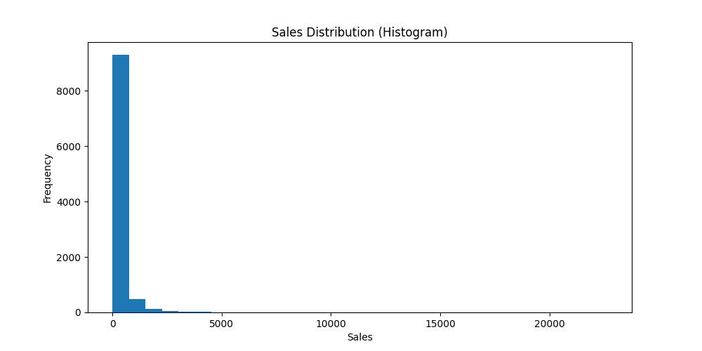
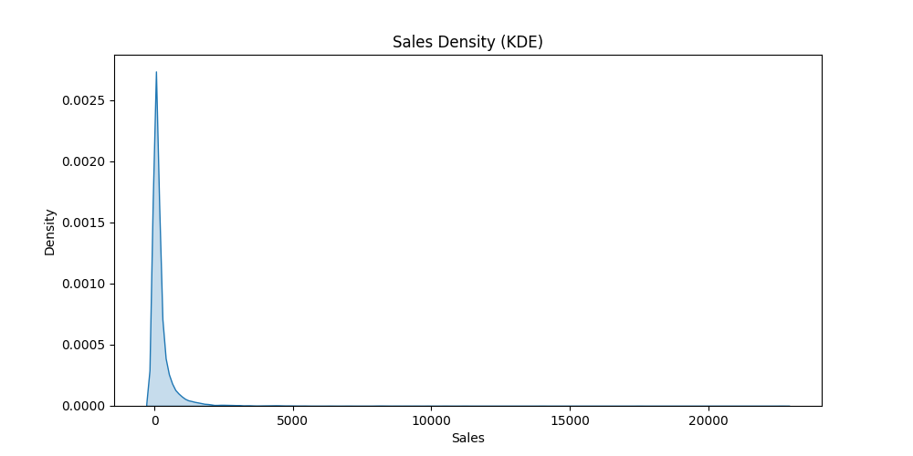
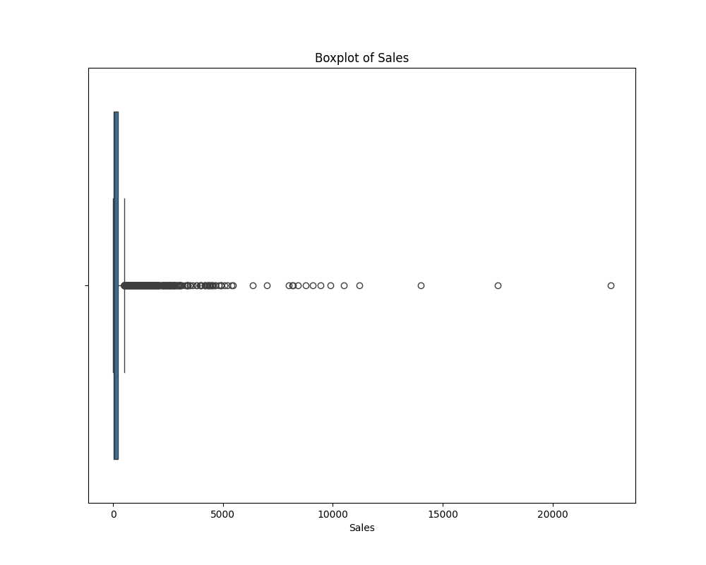

# 📊 Sales Distribution Analysis

## Project Overview
This project analyzes the distribution of sales data using statistical and visualization techniques. The goal is to understand data spread, detect outliers, and compare distributions across regions.

## Analysis Performed
- Histogram to study frequency distribution
- KDE plot to understand data density
- Boxplot to detect outliers
- Group comparison using region-wise boxplots
- Skewness and spread analysis

## Key Findings
- Sales data is highly positively skewed
- Presence of extreme outliers affecting distribution
- Significant variation in sales across regions

## Project Structure
- notebooks-Jupyter Notebook  
- data/-Dataset  
- output-Charts and summary  

## Tools Used
- Python
- Pandas
- Matplotlib
- Seaborn

## Visualizations

## Conclusion
The analysis highlights the importance of understanding data distribution and identifying outliers in real-world datasets.
